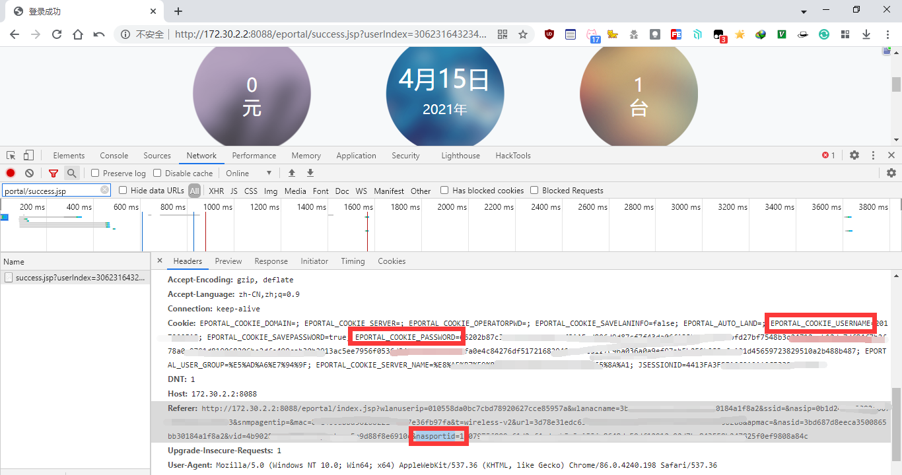

# 聊城大学校园网(LCU-WIFI)登录Shell脚本
- 此脚本仅供学习交流使用
- 用法为
  1. 在 [登录](http://172.30.2.2:8088) 前按F12抓包，登录成功后找`http://172.30.2.2:8088/eportal/success.jsp?userIndex****`的Cookie
  2. 下载脚本 [login](./login.sh) ，将所需值填入对应位置后运行脚本即可

```text
# Cookie内EPORTAL_COOKIE_USERNAME值，即 学号，为10位
userId=2017*****8
# Cookie内EPORTAL_COOKIE_PASSWORD的值，即 新版密码加密后的值，为256位
password=66202****488b487
```



